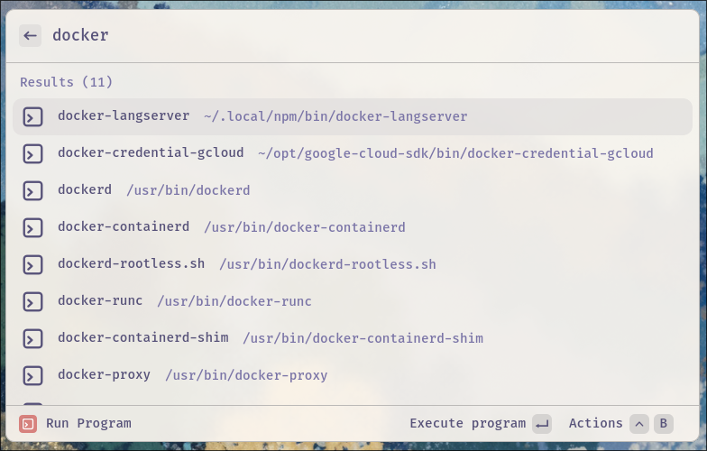
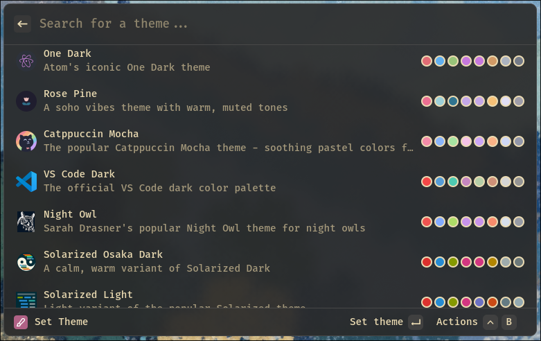
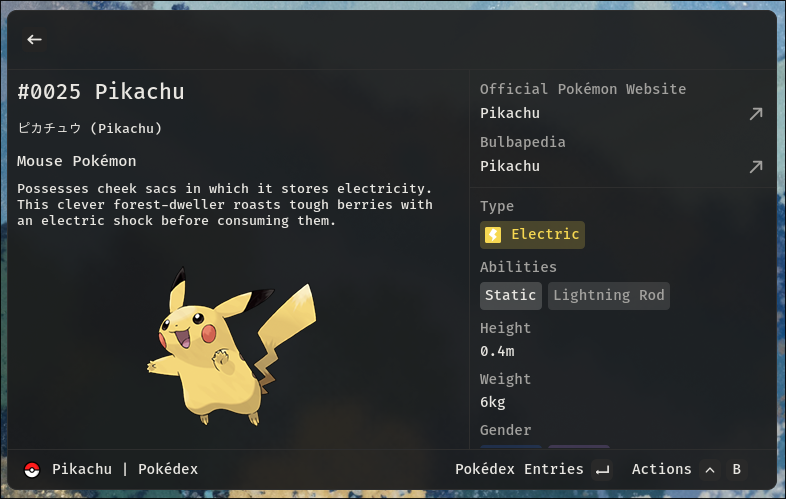
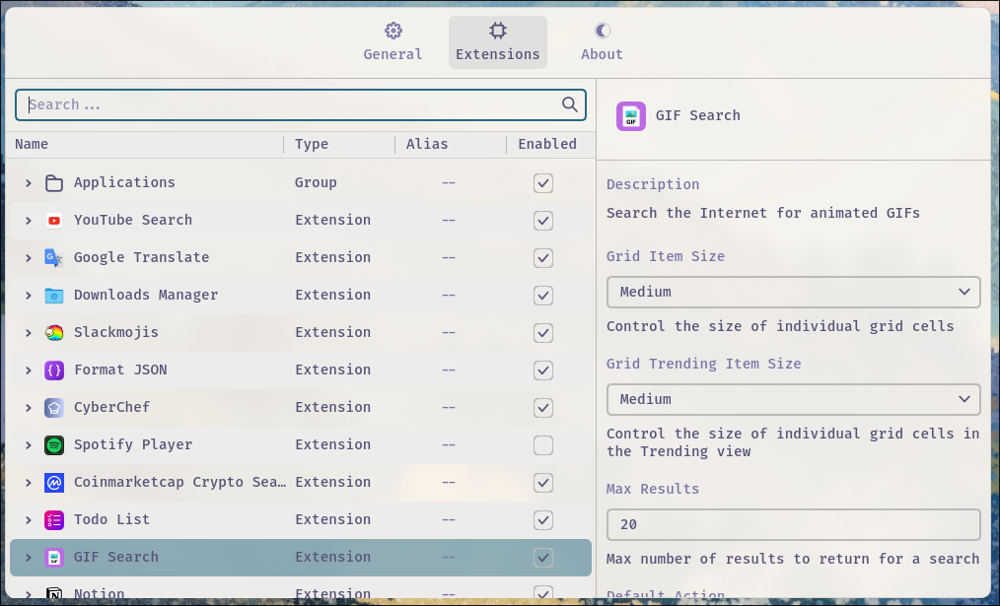

  

**Vicinae** (pronounced _"vih-SIN-ay"_) is a high-performance, native launcher for your desktop — built with C++ and Qt.

It comes with a rich set of built-in modules and can be easily extended using the [Typescript SDK](https://docs.vicinae.com/extensions/introduction).

Drawing inspiration from the [Raycast launcher](https://www.raycast.com/), Vicinae provides a mostly compatible extension API, allowing reuse of many existing Raycast extensions with minimal modification.

Vicinae is designed for developers and power users who want fast, keyboard-first access to common system actions.

  
https://github.com/user-attachments/assets/b5831ba7-dd16-407e-a05c-c2dbb468a0d6

We can't show everything in the demo, far from it, so please [go read the docs](https://docs.vicinae.com)!

---

## ✏️ Features

- Launch apps
- File search
- Emoji picker 
- Calculator with history (multiple backends available)
- Clipboard history
- Quickly open links using any app (can be used to set up web search)
- Focus open windows
- `dmenu` compatibility mode
- Theming system 
- Fallback commands
- React/Typescript extension SDK, allowing to build complex search-focused UIs
- Global [extension store](https://github.com/vicinaehq/extensions) (since v0.16.0)
- Raycast compatibility support  
  → Includes access to the official Raycast extension store, with one-click installs directly from within the launcher  
  → Many extensions may not work yet due to missing APIs or general Linux incompatibilities (improvements in progress)

## Breaking changes

Until we reach version 1 you should expect breaking changes from release to release. Watch the changelogs to learn about them.

We try to not introduce breaking changes that result in a definitive loss of data, but you should expect to have to redo your configuration from time to time.

## 📚 Documentation

For more details on installation, usage, configuration, extension development, and contributing, visit [docs.vicinae.com](https://docs.vicinae.com).

## A few more sick screenshots :)

  

  

  

  

  

