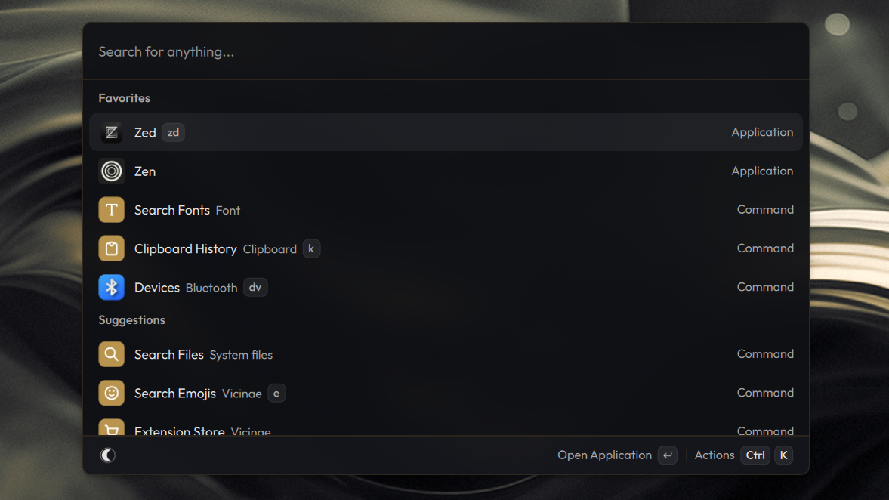

  

    
  

  
  <h1 align="center"><b>Vicinae</b></h1>
  <h4 align="center">A focused launcher for your desktop</h4>
  
  

     
    
  

  

**Vicinae** (pronounced _"vee-CHEE-nay"_) is a high-performance, native command palette for your desktop.

Out of the box, Vicinae can be your:

- app search
- [clipboard history](https://docs.vicinae.com/clipboard)
- [text expander (snippets)](https://docs.vicinae.com/snippets)
- [file search](https://docs.vicinae.com/file-search)
- [browser tab switcher](https://docs.vicinae.com/browser-extension)
- [emoji picker](https://docs.vicinae.com/emoji)
- [calculator](https://docs.vicinae.com/calculator)
- [window switcher](https://docs.vicinae.com/window)
- font browser
- volume controller

When you need more, Vicinae can be extended in several ways:

- [React/Typescript extensions](https://docs.vicinae.com/extensions), compatible with the Raycast ecosystem. In-app integration with the [Vicinae store](https://www.vicinae.com/extensions) and the [Raycast store](https://www.raycast.com/store).
- [Script commands](https://docs.vicinae.com/scripts/getting-started), also compatible with the Raycast feature of the same name, with special Vicinae additions.
- [dmenu style menu creation](https://docs.vicinae.com/dmenu), the linux minimalist way!

## Documentation

Everything you need to know to get started with Vicinae is at [vicinae.com](https://vicinae.com). If you have any question, please feel free to come ask it on [discord](https://discord.gg/rP4ecD42p7)!

## Sponsors

### Gold sponsors

<table>
  <tbody>
    <tr>
      <td align="center" valign="middle">
        <a href="https://depot.dev/?utm_source=vicinae&utm_medium=readme" target="_blank">
          <picture>
            <source media="(prefers-color-scheme: light)" srcset="https://depot.dev/assets/brand/1693758816/depot-logo-horizontal-on-light@3x.png" />
            <source media="(prefers-color-scheme: dark)" srcset="https://depot.dev/assets/brand/1693758816/depot-logo-horizontal-on-dark@3x.png" />
            
          </picture>
        </a>
      </td>
    </tr>
  </tbody>
</table>

### Silver Sponsors

<table>
  <tbody>
    <tr>
      <td align="center" valign="middle">
        
      </td>
    </tr>
  </tbody>
</table>

### Supporter sponsors

<table>
  <tbody>
    <tr>
      <td align="center" valign="middle">
        
      </td>
    </tr>
  </tbody>
</table>

---

[And all our other amazing sponsors!](https://github.com/sponsors/vicinaehq#sponsors)
