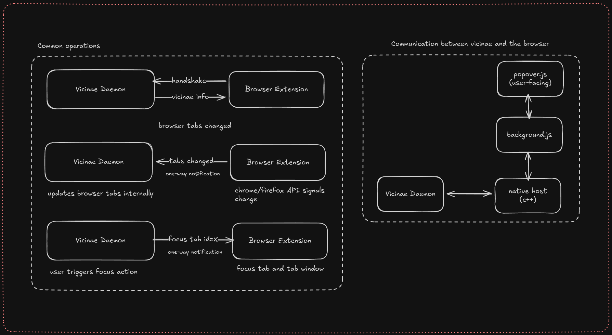

# Vicinae browser integration

This subdirectory contains:

- native bridge between browser extensions and vicinae daemon
- chromium/firefox browser extension. Currently the same codebase is used for both, but eventually we may have to split them.

For now the extension is not published to the official stores, this is a work in progress.

# Manual install

If you can't install the extension from the official stores, you can install the browser extension manually.

## Install native host manifest

The browser extension uses [Native messaging](https://developer.mozilla.org/en-US/docs/Mozilla/Add-ons/WebExtensions/Native_messaging) to communicate with the vicinae daemon.

The vicinae server installs per-user native host manifests automatically at startup, for every supported browser it detects on the system. Manifests are rewritten whenever their content is stale, so moving or updating vicinae self-heals on the next launch. There is nothing to do for a regular install.

The manifests are written to the standard per-user locations, for example:

- chromium family (Linux): `~/.config/<browser>/NativeMessagingHosts/com.vicinae.vicinae.json`
- chromium family (macOS): `~/Library/Application Support/<browser>/NativeMessagingHosts/com.vicinae.vicinae.json`
- firefox family (Linux): `~/.mozilla/native-messaging-hosts/com.vicinae.vicinae.json`
- firefox family (macOS): `~/Library/Application Support/Mozilla/NativeMessagingHosts/com.vicinae.vicinae.json`

Packagers can disable this behavior with the `AUTO_INSTALL_BROWSER_MANIFESTS` CMake option and provision manifests themselves (the expected JSON is shown below).

## Load the browser extension

### Chromium bases

You can load the `./chrome/` directory as any unpacked extension. 

Then modify the native host manifest (e.g at `~/.config/chromium/NativeMessagingHosts/com.vicinae.vicinae.json`) and change the origin in the `allowed_origins` array to use the local extension ID that was automatically generated upon loading the unpacked extension.

Note that the vicinae server rewrites manifests it does not recognize at startup, so make the file read-only (`chmod -w`) to keep your custom extension ID during development.

Once that is done, reloading the extension should automatically establish a connection with vicinae if the vicinae server is running.

### Firefox bases

#### Prerequisites

  * install the [web-ext](https://github.com/mozilla/web-ext) CLI tool.
  * register and authenticate a [Mozilla Add-on (AMO) account](https://addons.mozilla.org/en-US/firefox/#login) and generate your API keys in the [Mozilla Add-on Developer Hub](https://addons.mozilla.org/en-US/developers/addon/api/key/)
  * install and configure general prerequisites like git and make

#### Instructions

The following shell script demonstrates how to build and sign the app starting with cloning the repo, just update the variables at the beginning with your api secrets and the email address associated with them.

```
#!/bin/bash

AMO_EMAIL_ADDRESS="<yourAMO@email>"
WEB_EXT_API_KEY="<api cred:JWT issuer>" # user:[num:num] "user:12345678:123"
WEB_EXT_API_SECRET="<api cred:JWT secret>" # string  "123abc789abc............................................345abc90" 
WEB_EXT_CHANNEL="unlisted" # to build and distribute locally as opposed to the store with "listed"

git clone https://github.com/vicinaehq/vicinae
cd ./vicinae/src/browser-extension
sudo make firefox

cat > /lib/mozilla/native-messaging-hosts/com.vicinae.vicinae.json <<EOF
{
  "name": "com.vicinae.vicinae",
  "description": "Vicinae Native Messaging Host",
  "path": "/usr/libexec/vicinae/vicinae-browser-link",
  "type": "stdio",
  "allowed_extensions": [
    "$AMO_EMAIL_ADDRESS"
  ]
}
EOF

cd ./build/firefox
sed 's|"id": "vicinae@vicinae\.com"|"id": ""$AMO_EMAIL_ADDRESS"",\n      "data_collection_permissions": \{\n      "required": \["none"\],\n      "optional": \[\]\n      }|' -i ./manifest.json
web-ext sign
```
At this point the terminal will usually churn for around 6 minutes while the automated checks run online, it can be flagged for a human check which would delay it.
Once that's resolved a .xpi file will have populated in the firefox/web-ext-artifacts/ folder, import that into firefox.

* open Firefox and open the extensions menu, or enter 'about:addons' into your address bar and hit enter
* click the gear icon on the top right, select 'Install Add-on From File...'
* select the .xpi file

And upon restarting Firefox you should be good to go.  If you run into issues with signing [this page holds information on all 4 signing methods,](https://extensionworkshop.com/documentation/publish/signing-and-distribution-overview/) but you'll still need to alter the manifest if you submit through the webui

# Architecture schema


If that's any helpful, here is a very simple schema of how communication between vicinae and the browser works:


